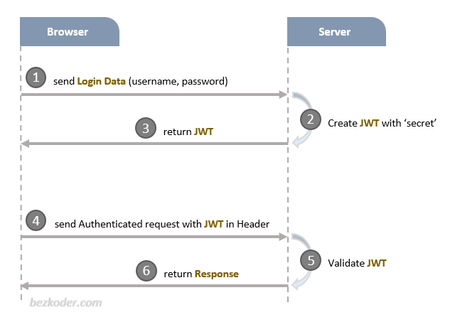
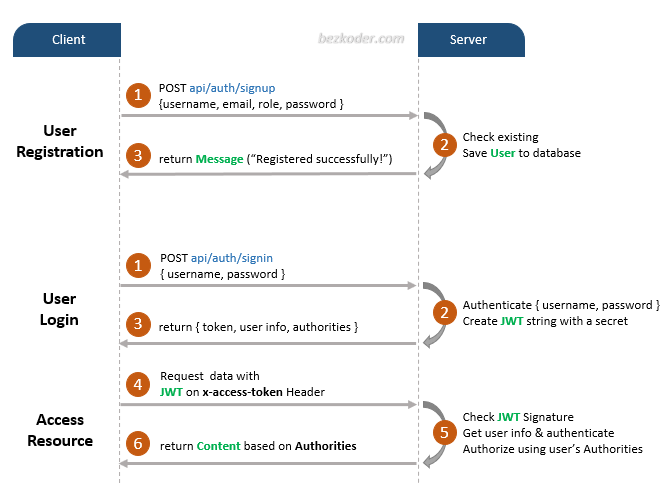
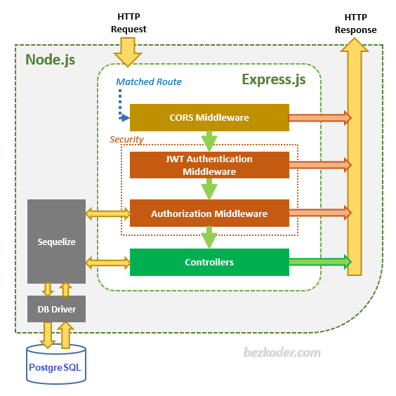

# Peoria Fresh API

This is the API for the Peoria Fresh project.

* Node.js
* Express
* bcryptjs
* jsonwebtoken
* Sequelize
* PostgreSQL

Credit to [BezKoder](https://github.com/bezkoder/node-js-jwt-authentication-postgresql)'s tutorial on JWT Auth with
Node.js.

## Getting Started

### Install Dependencies

```
$ npm install
```

### Proxy DB for Local Development

```
$ flyctl proxy 5432 -a peoriafresh-db
```

### Set Environment Variables for Node.js

* DATABASE_HOST
* DATABASE_PASSWORD
* DATABASE_USERNAME
* DATABASE_NAME
* TOKEN_SECRET

> Ask Evan Wieland for the values of these variables.

### Run the Server

```
$ npm start
```

### Deploy to Fly.io

```
$ fly deploy
```

## Overview

### API Endpoints

| Methods | Urls                         | Actions                       |
|---------|------------------------------|-------------------------------|
| POST    | /api/auth/signup             | Signup new account            |
| POST    | /api/auth/signin             | Login an account              |
| GET     | /api/public/all              | Retrieve public content       |
| GET     | /api/public/distributors     | Retrieve list of distributors |
| GET     | /api/public/produce          | Retrieve list of produce      |
| POST    | /api/public/consumer/request | Send produce request          |
| GET     | /api/test/admin              | Access Admin’s content        |
| GET     | /api/test/consumer           | Access Consumer’s content     |
| GET     | /api/distributor             | Access Distributor’s content  |
| GET     | /api/test/admin              | Access Admin’s content        |
| GET     | /api/distributor/requests    | View Distributor’s requests   |
| GET     | /api/producer                | View Producer's fulfillments  |
| GET     | /api/producer/fulfillments   | View Producer's fulfillments  |
| POST    | /api/producer/fulfillment    | Send fulfillment request      |

### Token Based Authentication



### Signup & Login with JWT Authentication



#### Refresh Token (Needs Implemented)


### Node.js Express Architecture

